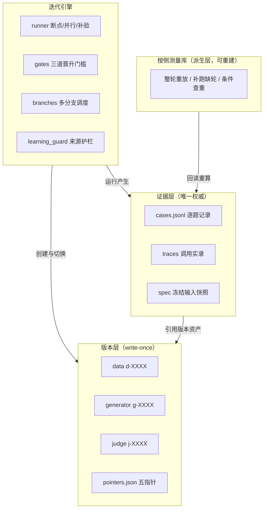

# Digital Human

**中文**

Digital Human 是一套基于盲测对抗的 AI 生成器迭代框架：生成器与盲测 Judge 交替升级，每轮只改一个方向，改动必须可证伪。系统唯一的优化指标是盲测 Judge 在固定测试题上把 AI 回复识别为 AI 的比例，越低越像真人。

框架主要解决三类问题：评测仪器存在固有噪声，主观感知提升与统计显著提升并不等价，迭代提速容易引发测试集过拟合。对应机制：版本 write-once、结论从证据回读重算、测量按条件复用、晋升三道门槛校验。

---

## 快速开始

- **环境**：Python 3.10+，一个 OpenAI 兼容的 LLM 端点
- **依赖**：`pip install -r requirements.txt`（torch / xgboost 为可选依赖，相关测试自动跳过）
- **数据**：`cp examples/chat_export.sample.jsonl data/chat_export.jsonl`（合成示例数据）
- **配置**：项目根 `.env` 写入 `DH_LLM_BASE_URL` / `DH_LLM_API_KEY`；`.env` 默认不进 Git
- **校验**：`python scripts/check.py code`（规则 / 文档 / 公开边界 / 回归 / 离线 demo 统一入口）
- **测试**：`python -m pytest tests/ -q`
- **初始化**：`python scripts/bootstrap.py --data data/chat_export.jsonl --model <生成模型>`
- **冒烟**：`python scripts/run.py --dataset development --change "接线验证" --limit 2`
- **后台**：`python scripts/serve_dashboard.py --port 8080` → http://localhost:8080/dashboard/

详细流程约束见 `docs/SOP.md`，文件格式与状态机见 `docs/IMPLEMENTATION.md`。

---

## 系统架构

### 总览：证据驱动的四层迭代

版本层 write-once 指版本目录本身；`pointers.json` 是全系统唯一可变的指针状态，晋升即切指针。

### 版本层：目录即版本，晋升只切指针

数据（切分 + 池 + 用途清单）、生成器（行为配置 + persona/场景快照）、Judge（判别配置 + 提示词 + 冻结校正模型）三类版本创建后 write-once；实验是唯一执行状态源。`pointers.json` 只有五个指针（data / production_gen / iteration_gen / production_judge / iteration_judge），晋升是把指针从旧版本切到新版本，没有拷贝、没有需要互相同步的第二状态。

### 证据层：所有判决结论均可从冻结证据回读重算

实验产物只有三样事实：`spec.json`（创建时冻结的版本引用、协议超参快照、材料指纹）、`cases.jsonl`（逐题初测判定、补验票、回复内容，append-only，只能经 `record_contract.writer` 写入）、`traces/`（每次大模型调用的完整提示词与响应）。state 里的汇总指标只是缓存——任何晋升判决都会逐题重读 cases.jsonl 重算，与写入值不一致即拒绝。修 scorer、修 bug、事后审计，全部回到调用实录。

### 按侧测量库：判定是绝对测量，对比是查询

Judge 对每侧的判定是"该侧回复 vs 同一道真人回复"的绝对测量，与和谁配对无关。因此测量按（侧, 题, 轮次）入库，每个测量携带 side / judge / pair / round 四元指纹，复用条件由指纹相等硬约束：

- 同条件的重复实验整轮重放，零模型调用；
- 缺补验轮的题只跑缺的轮，不再重跑一千题；
- 换 scorer 重计分是从已存特征纯重算，不碰模型；
- 判决使用测量前必须回读证据层原文行、重算指纹、逐字段比对——派生层可删可重建，篡改派生数据不影响最终判决的有效性。

复用的统计边界同样显式：同一实验内配对同测的两侧正相关、净胜方差更小；跨实验拼侧复用须先用历史数据做方差膨胀验证，验证不过就不放行。设计动机、统计论证与完整评审记录见 `docs/DESIGN-SIDE-MEASUREMENT-BANK.md`。

### 迭代引擎：门槛、补验与多分支

三道晋升门槛为固定准入、固定验收、推全；冒烟与开发是门槛前的预验证环节，不纳入正式门槛。learning_guard（学习护栏）在实验创建与运行期强制学习来源的时间边界、资产指纹与来源证明，来源未知的模型只许诊断、禁止消耗验收批次。一条候选的完整旅程：冒烟（接线）→ 开发（确认净胜 > 0，不消耗固定验收批次）→ 固定准入（候选与当前生产版本的直接对比，不消耗固定验收批次）→ 固定验收（消耗一次性固定批次，识别数严格改善且净胜达标）→ 推全（指针原子切换 + 凭证，其他分支基于新全量重测）。分支调度器支持多方向并行，`stage_limit` 可把分支限制在"只跑开发"。

Judge 是噪声仪器（实测相邻独立判定翻转率约 0.33），初测只是描述值：分歧题两侧各做 N 轮独立判定，按多数票出最终判定，门槛指标一律用补验后的**确认净胜**。达标是测量结论，已晋升只指指针切换或推全凭证。

---

## 数据边界与来源护栏

- **schema 2 规则**：
  - 全局时间窗口：学习 / 开发 / 验收按每题输入时刻过滤，学习材料必须早于截止时间并通过来源指纹核验；
  - 整聊天留出：未见对象作为独立验收条件；
- 引用消息保留：群聊 quote 类型消息带实质内容，导入时保留，防止假时间断层截短上下文。

验收与补验的票数规则：补验票按独立轮次指纹去重、按时间取最早凑足协议数量、禁止按结果挑选，全程写入凭证可复现。

## 工程基础设施

- `scripts/check.py code`：统一校验入口（与 CI 流程一致），聚合规则扫描 / 文档链接 / 公开边界 / 回归 / 离线 demo；
- `scripts/check_public.py --history`：公开边界扫描，含内容模式、路径黑名单、阻断词、src 依赖方向、git 提交元数据与全历史，fail-closed；
- `scripts/check_rules.py`：AST 级强制——版本 write-once、指针白名单写入、cases.jsonl 只能经 record_contract.writer；
- 可选重依赖（torch / xgboost）缺失时相关测试自动跳过，核心功能无外部模型也可离线演示。

## 项目结构

| 路径 | 职责 |
|---|---|
| `src/iteration/` | 迭代引擎：runner / gates / promote / branches / learning_guard / measurements |
| `src/judge/` | 盲测裁判：配对判定、特征抽取、冻结校正模型、mode 兼容 |
| `src/generator/` | 人格提示词、场景规则、few-shot 召回（策略冻结）、学习示例选择 |
| `src/bootstrap/` | 数据构建：ingest、切分、池、用途清单、时间窗口 |
| `src/dashboard/` | 工作台：基线与分支基线、四维筛选、逐题证据与调用实录、实时进度 |
| `scripts/` | 命令入口与统一校验 |
| `docs/` | SOP、架构、数据契约、测量库设计 |
| `tests/` | 回归测试 |

## 数据模型

| 对象 | 存储 | 不变量 |
|---|---|---|
| 数据版本 `d-XXXX` | 切分结果 + few-shot 池 + 用途清单 | 创建后只读 |
| 生成器版本 `g-XXXX` | 行为配置 + persona/场景快照 | 不含簿记字段 |
| Judge 版本 `j-XXXX` | 判别配置 + 提示词 + 校正模型 | 字节级指纹可重建 |
| 实验 | spec / cases.jsonl / state | 三事实分离，结论可重算 |
| 指针 `pointers.json` | 五指针：data / production_gen / iteration_gen / production_judge / iteration_judge | 唯一可变状态，晋升即切换 |
| 调用实录 `traces/` | 每次调用的提示词与响应 | append-only，随实验归档 |
| 测量记录（派生） | (侧, 题, 轮次) + 四元指纹 + 来源行号 | 可全量重建；判决前回读重算 |

## 核心术语

- **确认净胜**：初测分歧的题经两侧各自 N 轮独立补验、按多数票判定单题最终胜负后的胜题数 − 负题数；打平（contested）不计。生成器实验中"胜"指候选更像真人（未被识别为 AI）；
- **达标**：数值过门槛的测量结论，指针不动；
- **已晋升**：仅指针切换或存在推全凭证；固定准入、固定验收的通过属于门槛通过状态，不称已晋升；
- **分支基线**：分支自有的开发版指针，与生产基线分离，推全后两者合并；
- **按侧测量库**：按（侧, 题, 轮次）存储判定的派生层，携带 side / judge / pair / round 四元指纹；
- **四指纹**：side（版本+数据+用途）、judge（裁判全配置+协议）、pair（两侧+裁判+数据的组合）、round（独立抽签轮次），指纹相等是复用的唯一条件；
- **回读重算**：使用任何测量或判决前，回读证据层原文行、重算指纹并逐字段比对（晋升判决、换 scorer 重算、事后审计共用此路径）；
- **同对重放 / 缺轮补跑**：同一配对已有完整测量时新实验零调用复现；只缺部分补验轮时仅执行缺的轮；
- **write-once**：版本与证据创建后只读，改动 = 新建版本；
- **one-shot**：固定验收批次分配即消耗，同一候选不得重复评测；
- **stage_limit**：分支级开关，限制分支只跑到开发阶段，不进入固定门槛。

## 文档索引

- `docs/SOP.md` —— 流程约束与合法步骤（唯一权威流程）
- `docs/IMPLEMENTATION.md` —— 文件格式、状态机、校验细节
- `docs/ARCHITECTURE.md` / `docs/DATA_MODEL.md` —— 架构与数据模型
- `docs/DESIGN-SIDE-MEASUREMENT-BANK.md` —— 按侧测量库设计（含七轮评审记录）
- `docs/OPERATIONS.md` —— 运维

## License

MIT（见 LICENSE）。示例数据为合成样本，与任何真实个人无关；请勿将真实聊天记录、密钥或人设提交到仓库。
