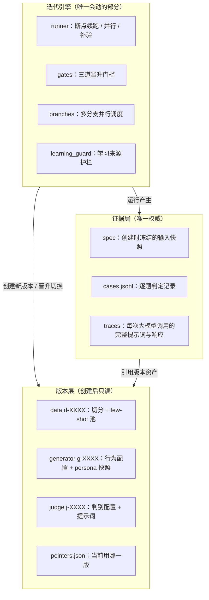

# Digital Human

**中文**

Digital Human 是一套用于迭代拟人化对话 AI 的对抗式评测与迭代框架：通过生成器与盲测裁判的交替对抗升级，把"像不像人"变成可量化、可持续优化的指标。

## 这个项目是怎么来的

让 AI 学会"像人一样聊天"首先是个度量问题：不存在可以直接优化的"像人程度"指标。让 LLM 直接当裁判打分会被裁判自己的风格偏好带偏，而且裁判本身也会犯错——我们实测相邻两次独立判定，结论翻转率约 0.33。

Digital Human 的思路是把度量问题变成对抗问题：

- 不直接问"这条回复像不像人"，而是让盲测 Judge 只看一段对话记录，猜哪一条是 AI 写的。猜不出来，就是像人。
- 生成器与 Judge 交替升级：生成器想办法骗过 Judge，Judge 想办法识破生成器。对抗让双方互相逼强，降低指标停留在易钻空子的局部形态的风险。
- 每轮迭代只升级生成器或 Judge 其中一方，改动必须可证伪：迭代生成器时，固定 Judge 下 AI 识别数必须下降；迭代 Judge 时，固定生成器下 AI 识别数必须上升，才算这一轮的收益。

围绕这个框架还有三个工程判断：

1. **评测仪器有噪声，就按噪声仪器用。** 单次判定只是描述值；有分歧的题两侧各自补做 N 轮独立判定、按多数票出最终判定，净胜是所有门槛的核心判定指标；个别门槛还有叠加约束——如固定验收除净胜达标外，还要求识别数严格改善。
2. **迭代越快越容易过拟合测试集。** 固定验收批次一次性分配、用完即消耗，同一候选不得重复评测；开发阶段用自己的批次，不碰固定验收批次。
3. **主观感知提升 ≠ 统计显著提升。** 有收益的候选先成为下一轮开发基线；正式替换生产版本必须经过与生产版本的直接对比，净胜达标才算数。

## 快速开始

- **环境**：Python 3.10+，一个 OpenAI 兼容的 LLM 端点
- **依赖**：`pip install -r requirements.txt`（torch / xgboost 为可选依赖，相关测试自动跳过）
- **数据**：`cp examples/chat_export.sample.jsonl data/chat_export.jsonl`（合成示例数据）
- **配置**：项目根 `.env` 写入 `DH_LLM_BASE_URL` / `DH_LLM_API_KEY`；`.env` 默认不进 Git
- **校验**：`python scripts/check.py code`（代码、文档、功能的统一校验入口）
- **测试**：`python -m pytest tests/ -q`
- **初始化**：`python scripts/bootstrap.py --data data/chat_export.jsonl --model <你的 LLM 模型 ID，需与配置的端点兼容>`
- **冒烟**：`python scripts/run.py --dataset development --change "本次改动的简述（用于标记实验）" --limit 2`
- **后台**：`python scripts/serve_dashboard.py --port 8080` → http://localhost:8080/dashboard/

详细流程约束见 `docs/SOP.md`，文件格式与状态机见 `docs/IMPLEMENTATION.md`。

---

## 系统架构

### 总览：三层分工

- **版本层**保存全部资产：数据切分、生成器配置、Judge 配置。创建后只读，改动等于新建版本——任何历史状态都留得下、回得去。
- **证据层**记录每次实验到底发生了什么：输入快照、逐题判定、每次调用的完整实录。页面和汇总文件里的指标只是缓存，任何晋升决定都会逐题重读原始判定重新计算，对不上就拒绝执行，所以修打分逻辑、修 bug、事后审计都不需要信任任何中间统计结果，直接以原始证据为准。
- **迭代引擎**负责跑实验、算指标、决定指针切给谁；learning_guard 在实验创建与运行期校验学习材料的来源与时间边界，来源不明的模型只许诊断、不许进验收。`pointers.json` 只有五个指针（数据 / 生产生成器 / 迭代生成器 / 生产 Judge / 迭代 Judge），晋升不是拷贝文件，只是切指针——系统里没有第二份需要互相同步的状态。

### 版本层里有什么：data / generator / judge 三类资产

框架里所有会被迭代的东西都建模成版本——一个目录，创建后只读，改动等于新建版本：

- **数据版本 `d-XXXX`**：从原始聊天记录构建。ingest 保留引用消息等实质内容，按全局时间窗口切出学习 / 开发 / 验收三个用途，整聊天留出保证验收能考"没见过的人"。切分规则和随机种子写死在版本里，任何人拿到同一份原始导出都能重建出同一个数据版本。
- **生成器版本 `g-XXXX`**：行为配置 + persona / 场景快照 + few-shot 召回配置。召回策略本身冻结，学习的是"从池里选哪几个示例"——用到学习到的 ranker 模型时，权重作为版本资产一起登记，保证这个版本在任何机器上的行为一致、可回退。
- **Judge 版本 `j-XXXX`**：判别配置 + 盲测提示词 + 冻结的校正模型。Judge 和生成器一样按版本迭代（换特征、换提示词、换校正模型），双方交替升级。

实验不内嵌任何配置，只引用版本号；`pointers.json` 的五个指针（数据 / 生产生成器 / 迭代生成器 / 生产 Judge / 迭代 Judge）决定当前各角色用哪一版。仓库自带的合成示例数据（`examples/chat_export.sample.jsonl`）跑一遍 `scripts/bootstrap.py` 就能初始化出第一组 d / g / j 版本和指针，之后的每一轮迭代都是在这套版本之上切指针。

### 一条候选的完整旅程

确认净胜指候选与对照版本逐题对比、经补验多数票裁决后的胜题数 − 负题数（打平题目不计）：开发阶段对照当前分支的开发基线，准入 / 验收阶段对照生产版本。

**预验证（不消耗固定验收批次）**

1. **冒烟**：几道开发题，验证接线正确。
2. **开发**：1000 道开发题，确认净胜 > 0 即"这个改动方向值得继续"。通过的候选成为该分支下一轮的开发基线。

**三道晋升门槛：固定准入 → 固定验收 → 推全**

1. **固定准入**：候选与当前生产版本直接对比，不消耗固定验收批次——防止"开发集涨、生产跌"的方向误判混进验收。
2. **固定验收**：消耗一次性分配的固定批次（1000 题）。Judge 识别数严格改善且确认净胜达标，候选才可替换生产。
3. **推全**：指针原子切换并写入凭证；其他分支基于新的生产版本全量重测。

多分支调度器支持多个方向并行迭代（人格提示词、场景规则、对话节奏等）：每个分支有自己的开发基线指针，与生产基线互不干扰；某分支候选推全后，其他分支基于新生产版本全量重测，基线重新对齐。为了让每次判定都可被独立轮次复现，判定记录按（被测版本, 题目, 轮次）入库——同一条件下的重复实验直接复用历史判定，只缺部分补验轮的题只跑缺的轮，这是迭代能跑快的基础设施。

### 数据边界

训练/迭代不能偷看验收数据，靠切分规则保证而不是靠自觉：

- **全局时间窗口**：学习、开发、验收按每道题的输入时刻过滤，学习材料必须早于截止时间，且通过来源证明核验；
- **整聊天留出**：没见过的聊天对象作为独立验收条件；
- **引用消息保留**：群聊中的引用消息带有实质内容，导入时保留，避免假的时间断层把上下文截短。

## 工程基础设施

- `scripts/check.py code`：统一校验入口，覆盖规则扫描、文档有效性、敏感信息检查、回归验证、离线演示等；
- `scripts/check_rules.py`：版本目录只读、指针白名单写入等规则的代码级强制；
- 可选重依赖（torch / xgboost）缺失时相关测试自动跳过，核心功能无外部模型也可离线演示。

## 项目结构

| 路径 | 职责 |
|---|---|
| `src/iteration/` | 迭代引擎：runner / gates / promote / branches / learning_guard / measurements |
| `src/judge/` | 盲测裁判：配对判定、特征抽取、冻结校正模型 |
| `src/generator/` | 人格提示词、场景规则、few-shot 召回（策略冻结）、学习示例选择 |
| `src/bootstrap/` | 数据构建：ingest、切分、池、时间窗口 |
| `src/dashboard/` | 工作台：基线与分支基线、筛选、逐题证据与调用实录、实时进度 |
| `scripts/` | 命令入口与统一校验 |
| `docs/` | SOP、架构、数据契约、设计文档 |
| `tests/` | 回归测试 |

## 文档索引

- `docs/SOP.md` —— 流程约束与合法步骤（唯一权威流程）
- `docs/IMPLEMENTATION.md` —— 文件格式、状态机、校验细节
- `docs/ARCHITECTURE.md` / `docs/DATA_MODEL.md` —— 架构与数据模型
- `docs/DESIGN-SIDE-MEASUREMENT-BANK.md` —— 判定复用与按侧测量的设计（含评审记录）
- `docs/OPERATIONS.md` —— 运维

## License

MIT（见 LICENSE）。示例数据为合成样本，与任何真实个人无关；请勿将真实聊天记录、密钥或人设提交到仓库。
