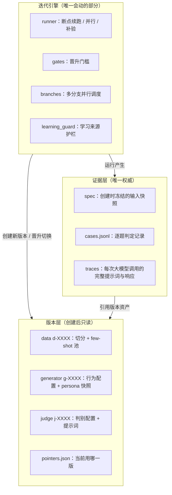

# Digital Human

**中文**

Digital Human 是一套用于迭代拟人化对话 AI 的对抗式评测与迭代框架。思路启发来自 GAN：用生成器与判别器的对抗循环，把"像不像人"变成可量化、可持续优化的指标。

## 思路：把 GAN 的对抗循环搬到对话迭代上

GAN 里生成器造样本、判别器打假，双方在对抗中一起变强。Digital Human 把同一个思路搬到"让 AI 说话像人"上：

- **判别器是盲测 Judge**：只看一段对话记录，猜哪一条是 AI 写的。猜不出来，就是像人。
- **生成器与 Judge 交替升级**：生成器想办法骗过 Judge，Judge 想办法识破生成器。每轮只升级其中一方，改动必须可证伪——迭代生成器时固定 Judge，看 AI 识别数是否下降；迭代 Judge 时固定生成器，看识别数是否上升。
- **对抗循环靠实验驱动**：对话没法像图像那样反向传播梯度，所以用受控实验代替反向传播——固定测试题、固定 Judge、完整留存的判定记录，用统计门槛决定一轮改动算不算数。

和 GAN 还有一个关键不同：这里的判别器不可微，而且会犯错——我们实测相邻两次独立判定，结论翻转率约三分之一。所以单次判定只是描述值：有分歧的题两侧各自补做若干轮独立判定、按多数票出最终判定，净胜是核心判定指标——个别门槛还有叠加约束，如固定验收除净胜达标外还要求识别数严格改善。围绕这个框架还有两个工程判断：

1. **迭代越快越容易过拟合测试集。** 固定验收批次一次性分配、用完即消耗，同一候选不得重复评测；训练数据按全局时间窗口与学习 / 验收隔离切分，防泄露靠规则不靠自觉。
2. **主观感知提升 ≠ 统计显著提升。** 有收益的候选先成为下一轮开发基线；替换生产版本必须与生产直接对比、净胜达标才算数。

## 系统架构

### 总览：三层分工

- **版本层**保存全部资产：数据切分、生成器配置、Judge 配置。创建后只读，改动等于新建版本——任何历史状态都留得下、回得去。
- **证据层**记录每次实验的原始输入、逐题判定与每次大模型调用的完整实录，是唯一权威数据源；任何晋升决定都从原始判定重新核算，与汇总值对不上就拒绝执行。
- **迭代引擎**负责跑实验、算指标、决定指针切给谁，learning_guard 守住学习来源边界。`pointers.json` 只有五个指针（数据 / 生产生成器 / 迭代生成器 / 生产 Judge / 迭代 Judge），晋升不是拷贝文件，只是切指针——系统里没有第二份需要互相同步的状态。

### 版本层里有什么：data / generator / judge 三类资产

框架里所有会被迭代的东西都建模成版本——一个目录，创建后只读，改动等于新建版本：

- **数据版本 `d-XXXX`**：从原始聊天记录构建。导入时保留引用消息等实质内容，按全局时间窗口切出学习 / 开发 / 验收三个用途，整聊天留出保证验收能考"没见过的人"。切分规则和随机种子写死在版本里，任何人拿到同一份原始导出都能重建出同一个数据版本。
- **生成器版本 `g-XXXX`**：行为配置 + persona / 场景快照 + few-shot 召回配置。召回策略本身冻结，学习的是"从池里选哪几个示例"；用到学习到的模型时，权重一并登记为版本资产，保证这个版本在任何机器上行为一致、可回退。
- **Judge 版本 `j-XXXX`**：判别配置 + 盲测提示词，与生成器一样按版本交替迭代——调整判别逻辑、优化提示词都是新建一个 Judge 版本。

实验不内嵌任何配置，只引用版本号。仓库自带的合成示例数据跑一遍 `scripts/bootstrap.py` 就能初始化出第一组 d / g / j 版本和指针，之后每一轮迭代都是在这套版本之上切指针。

### 一条候选的完整旅程

净胜（补验多数票裁决后的胜题数 − 负题数，打平不计）是核心判定指标：开发阶段候选对照分支的开发基线，准入 / 验收阶段对照生产版本。

一个候选从想法到生产：**冒烟**（接线验证）→ **开发**（净胜 > 0，成为该分支下一轮的开发基线）→ **固定准入**（与生产直接对比，不消耗验收批次）→ **固定验收**（消耗一次性固定批次，净胜达标才可替换生产）→ **推全**（指针切换，其他分支基于新版本全量重测、基线对齐）。

多分支调度器支持多个方向并行迭代（人格提示词、场景规则、对话节奏等），每个分支有自己的开发基线指针，与生产基线互不干扰。为了让每次判定都可复现，判定记录按（被测版本, 题目, 轮次）留存：同一条件下的重复实验直接复用历史判定，只缺部分补验轮的题只跑缺的轮——这是迭代能跑快的基础设施。

## 快速开始

- **环境**：Python 3.10+，一个 OpenAI 兼容的 LLM 端点
- **依赖**：`pip install -r requirements.txt`（torch / xgboost 为可选依赖，相关测试自动跳过）
- **数据**：`cp examples/chat_export.sample.jsonl data/chat_export.jsonl`（合成示例数据）
- **配置**：项目根 `.env` 写入 `DH_LLM_BASE_URL` / `DH_LLM_API_KEY`；`.env` 默认不进 Git
- **初始化**：`python scripts/bootstrap.py --data data/chat_export.jsonl --model <你的 LLM 模型 ID，需与配置的端点兼容>`
- **冒烟**：`python scripts/run.py --dataset development --change "本次改动的简述（用于标记实验）" --limit 2`

更多操作（测试、后台工作台、流程约束）见 `docs/SOP.md`。

## 项目结构

| 路径 | 职责 |
|---|---|
| `src/iteration/` | 迭代引擎：runner / gates / promote / branches / learning_guard |
| `src/judge/` | 盲测裁判与校正模型 |
| `src/generator/` | 人格与场景配置、示例召回、学习示例选择 |
| `src/bootstrap/` | 数据构建：导入、切分、池、时间窗口 |
| `src/dashboard/` | 工作台：基线、分支、逐题证据、实时进度 |
| `scripts/` | 命令入口 |
| `docs/` | SOP、架构、数据契约、设计文档 |
| `tests/` | 回归测试 |

## 文档索引

- `docs/SOP.md` —— 流程约束与合法步骤（唯一权威流程）
- `docs/ARCHITECTURE.md` / `docs/DATA_MODEL.md` —— 架构与数据模型
- `docs/IMPLEMENTATION.md` —— 文件格式、状态机、校验细节

## License

MIT（见 LICENSE）。示例数据为合成样本，与任何真实个人无关；请勿将真实聊天记录、密钥或人设提交到仓库。
