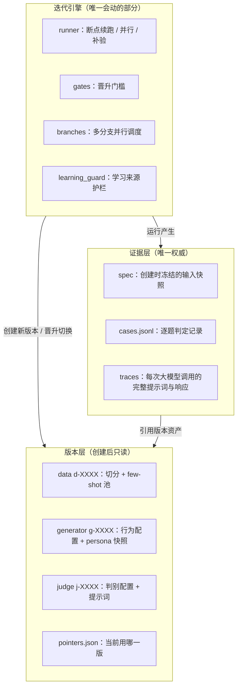

# Digital Human


**中文**

Digital Human 是一套用于迭代拟人化对话 AI 的对抗式评测与迭代框架。思路启发来自 GAN：用生成器与判别器的对抗循环，把"像不像人"变成可量化、可持续优化的指标。

## 思路：把 GAN 的对抗循环搬到对话迭代上

GAN 里生成器造样本、判别器打假，双方在对抗中一起变强。Digital Human 把同一个思路搬到"让 AI 说话像人"上：

- **判别器是盲测 Judge**：只看一段对话记录，猜哪一条是 AI 写的。猜不出来，就是像人。
- **生成器与 Judge 交替升级**：生成器想办法骗过 Judge，Judge 想办法识破生成器。每轮只升级其中一方，改动必须可证伪——迭代生成器时固定 Judge，看 AI 识别数是否下降；迭代 Judge 时固定生成器，看识别数是否上升。
- **对抗循环靠实验驱动**：对话没法像图像那样反向传播梯度，所以用受控实验代替反向传播——固定测试题、固定 Judge、完整留存的判定记录，用统计门槛决定一轮改动算不算数。

和 GAN 还有一个关键不同：这里的判别器不可微，而且会犯错——我们实测相邻两次独立判定，结论翻转率约三分之一。所以单次判定只是描述值：有分歧的题两侧各自补做若干轮独立判定、按多数票出最终判定，净胜是核心判定指标——个别门槛还有叠加约束，如固定验收除净胜达标外还要求识别数严格改善。围绕这个框架还有两个工程判断：

1. **迭代越快越容易过拟合测试集。** 固定验收批次一次性分配、用完即消耗，同一候选不得重复评测；训练数据按全局时间窗口与学习 / 验收隔离切分，防泄露靠规则不靠自觉。
2. **主观感知提升 ≠ 统计显著提升。** 有收益的候选先成为下一轮开发基线；替换生产版本必须与生产直接对比、净胜达标才算数。

## 系统架构

### 总览：三层分工


```mermaid
graph TD
    subgraph Engine["迭代引擎（唯一会动的部分）"]
        RUN[runner：断点续跑 / 并行 / 补验]
        GATE[gates：晋升门槛]
        BR[branches：多分支并行调度]
        GUARD[learning_guard：学习来源护栏]
    end
    subgraph Versions["版本层（创建后只读）"]
        DATA[data d-XXXX：切分 + few-shot 池]
        GEN[generator g-XXXX：行为配置 + persona 快照]
        JUDGE[judge j-XXXX：判别配置 + 提示词]
        PTR[pointers.json：当前用哪一版]
    end
    subgraph Evidence["证据层（唯一权威）"]
        SPEC[spec：创建时冻结的输入快照]
        CASES[cases.jsonl：逐题判定记录]
        TRACE[traces：每次大模型调用的完整提示词与响应]
    end
    Engine -->|运行产生| Evidence
    Engine -->|创建新版本 / 晋升切换| Versions
    Evidence -->|引用版本资产| Versions
```

- **版本层**保存全部资产：数据切分、生成器配置、Judge 配置。创建后只读，改动等于新建版本——任何历史状态都留得下、回得去。
- **证据层**记录每次实验的原始输入、逐题判定与每次大模型调用的完整实录，是唯一权威数据源；任何晋升决定都从原始判定重新核算，与汇总值对不上就拒绝执行。
- **迭代引擎**负责跑实验、算指标、决定指针切给谁，learning_guard 守住学习来源边界。`pointers.json` 只有五个指针（数据 / 生产生成器 / 迭代生成器 / 生产 Judge / 迭代 Judge），晋升不是拷贝文件，只是切指针——系统里没有第二份需要互相同步的状态。

### 版本层里有什么：data / generator / judge 三类资产

框架里所有会被迭代的东西都建模成版本——一个目录，创建后只读，改动等于新建版本：

- **数据版本 `d-XXXX`**：从原始聊天记录构建。导入时保留引用消息等实质内容，按全局时间窗口切出学习 / 开发 / 验收三个用途，整聊天留出保证验收能考"没见过的人"。切分规则和随机种子写死在版本里，任何人拿到同一份原始导出都能重建出同一个数据版本。
- **生成器版本 `g-XXXX`**：行为配置 + persona / 场景快照 + few-shot 召回配置。召回策略本身冻结，学习的是"从池里选哪几个示例"；用到学习到的模型时，权重一并登记为版本资产，保证这个版本在任何机器上行为一致、可回退。
- **Judge 版本 `j-XXXX`**：判别配置 + 盲测提示词，与生成器一样按版本交替迭代——调整判别逻辑、优化提示词都是新建一个 Judge 版本。

实验不内嵌任何配置，只引用版本号。仓库自带的合成示例数据跑一遍 `scripts/bootstrap.py` 就能初始化出第一组 d / g / j 版本和指针，之后每一轮迭代都是在这套版本之上切指针。

### 一条候选的完整旅程

净胜（补验多数票裁决后的胜题数 − 负题数，打平不计）是核心判定指标：开发阶段候选对照分支的开发基线，准入 / 验收阶段对照生产版本。

一个候选从想法到生产：**冒烟**（接线验证）→ **开发**（净胜 > 0，成为该分支下一轮的开发基线）→ **固定准入**（与生产直接对比，不消耗验收批次）→ **固定验收**（消耗一次性固定批次，净胜达标才可替换生产）→ **推全**（指针切换，其他分支基于新版本全量重测、基线对齐）。

多分支调度器支持多个方向并行迭代（人格提示词、场景规则、对话节奏等），每个分支有自己的开发基线指针，与生产基线互不干扰。为了让每次判定都可复现，判定记录按（被测版本, 题目, 轮次）留存：同一条件下的重复实验直接复用历史判定，只缺部分补验轮的题只跑缺的轮——这是迭代能跑快的基础设施。

## 快速开始

- **环境**：Python 3.10+，一个 OpenAI 兼容的 LLM 端点
- **依赖**：`pip install -r requirements.txt`（torch / xgboost 为可选依赖，相关测试自动跳过）
- **数据**：`cp examples/chat_export.sample.jsonl data/chat_export.jsonl`（合成示例数据）
- **配置**：项目根 `.env` 写入 `DH_LLM_BASE_URL` / `DH_LLM_API_KEY`；`.env` 默认不进 Git
- **初始化**：`python scripts/bootstrap.py --data data/chat_export.jsonl --model <你的 LLM 模型 ID，需与配置的端点兼容>`
- **冒烟**：`python scripts/run.py --dataset development --change "本次改动的简述（用于标记实验）" --limit 2`

更多操作（测试、后台工作台、流程约束）见 `docs/SOP.md`。

### 私有后台访问

`scripts/serve_dashboard.py` 只监听 `127.0.0.1:8080`。页面、接口及文件下载统一要求
HTTP Basic 登录；远程访问必须通过 HTTPS 反向代理或隧道。首次启动自动生成独立的
`owner` 账号及随机密码，保存在 `~/.config/digital-human/dashboard-auth.json`，权限为
`0600`，不在仓库或网页服务目录内。重启沿用原凭据；凭据损坏或权限不安全时拒绝访问。
浏览器首次打开原后台地址时输入该文件中的账号、密码即可。不要将凭据放进分享 URL。

部署后使用统一入口验证匿名拒绝和认证访问（只输出状态，不输出密码或私有正文）：

```bash
.venv/bin/python scripts/check.py dashboard --instance <实例名> \
  --base-url https://<后台域名> --share <Share版本>
```

## 项目结构

| 路径 | 职责 |
|---|---|
| `src/iteration/` | 迭代引擎：runner / gates / promote / branches / learning_guard |
| `src/judge/` | 盲测裁判与校正模型 |
| `src/generator/` | 人格与场景配置、示例召回、学习示例选择 |
| `src/bootstrap/` | 数据构建：导入、切分、池、时间窗口 |
| `src/dashboard/` | 工作台：基线、分支、逐题证据、实时进度 |
| `scripts/` | 命令入口 |
| `docs/` | SOP、架构、数据契约、设计文档 |
| `tests/` | 回归测试 |

## 检索与实验性能：完整技术说明

> 核查日期：2026-10-02。本节解释示例选择从召回、特征到排序的实际实现，以及一次实验的计时证据，不是通用搜索架构介绍，也不改变实验条件或晋级标准。
>
> **版本边界**：基础召回、学习排序及下文的磁盘读取、检索缓存、材料复用与 profile 改造，均随配套功能提交入库。计时对应 2026-10-02 核查时的运行工作区快照，不保证当前源码 HEAD 能完全复现该次运行。代码发布不代表整体优化收益已验收，待做项也不因此变成已完成。

### 先说结论：慢在哪里

当前“检索”不是从数据库索引里直接取最相关的 12 条，而是：**扫描历史池做隔离 → 取一个可能很大的候选桶 → 逐条读取、解码、打分 → 把整个桶排序 → 才取 12 条**。同一题通常走两路召回，合并后才进入最多 24 条候选的学习排序。

因此，最后只使用 3 条示例，不代表前面只读取或处理了 3 条。把正文与词表放到磁盘，解决的是大量 Python 对象常驻内存的问题，**没有自动把全池过滤和大桶扫描变成索引 Top-K 查询**。

同时，实验入口仍有全池批准检查、学习材料校验、ranker 来源重建；运行中的材料变更检查也还会递归遍历文件。它们与检索、模型请求是不同阶段，均有显著耗时。当前计时中的整次检索锁等待接近零，不能继续把慢笼统归因于“读取有锁”。

### 1. 一道题的完整链路

```text
加载冻结 Data / Gen / Judge 及来源绑定
  → 检查历史池、学习材料与 ranker 证明
  → 读取当前题的上下文、时间边界和来源 ID
  → 最近 3 条消息组成 query：基础召回最多 12 条
  → 最近 1 条消息组成 query：基础召回最多 12 条
  → 按示例 ID 合并去重：最多 24 条
  → 读取或提取目标上下文、示例上下文、示例回复的语义特征
  → 本地构造交叉特征，稀疏 one-hot 编码
  → XGBoost 给每个候选打分
  → 正文与来源去重，按完整示例字符预算选最多 3 条
  → 拼回复提示词，调用回复模型
  → 固定 Judge 判定；必要时沿原协议补判
  → 保存逐题记录、调用 trace 与可复用测量
```

入口在 [`src/generator/generator.py`](src/generator/generator.py)，学习选择策略名为 `pairwise_xgb_v1`，具体编排在 [`src/generator/learned_selection.py`](src/generator/learned_selection.py)。

这条链路中至少有三类不同的模型用途：**提取检索特征、生成回复、Judge 评判**。替换回复模型并不会自动替换另外两类模型，也不会消除本地扫描和校验耗时。基础召回本身不请求大模型。

### 2. 基础召回：如何构造 query 和候选

`learned_selection.recall` 顺序执行两路 `retrieve(limit=12)`：

1. 用上下文最近 3 条消息正文拼接 query；不足 3 条时使用已有消息。
2. 用最近 1 条消息正文作为另一个 query。
3. 同时传入聊天标识、群聊/私聊、当前上下文消息、题目来源边界及排除 ID。
4. 按示例 ID 去重，重复示例保留较好的召回名次，再稳定排序；候选上限为 24，不保证一定有 24 条。

基础召回在 [`src/generator/few_shot.py`](src/generator/few_shot.py) 的 `PersonaFewShotRetriever.retrieve`。其查询表示是规则词频，不是 embedding：

- `_terms` 对文本去空白、转小写，仅保留字母、数字、汉字；取前 12 个单字符，加上文本相邻双字符的 bigram，组成 `Counter`。
- 同时用规则识别情境、期望接话动作、末条消息形态、群参与结构等。
- 当前 `_load_embeddings()` 返回空，编码器与 query embedding 为空；这一路**没有在线向量编码、ANN 或向量数据库检索**。

在真正计算相关性前，还要按当前题筛来源：

- `history.filter_rows` 遍历历史池，保留可用于该题的示例；随后还会遍历池构造排除 ID。
- 检查历史时间边界、聊天用途隔离、目标回复来源与示例来源不交叉等。
- 基础边界逻辑可识别经过认证的同秒顺序；学习召回额外要求 `source_span.end_timestamp < input_cutoff.timestamp`，即示例历史年龄严格为正。
- 可选 `exclude_reply_in_context_v1` 会在两路合并后排除“示例回复已经出现在目标上下文”的整条例子，不额外补召回。此项不是下面列出的四个历史版本默认启用项。

这些是**逐题的数据隔离条件**，与“一个 Data 版本是否已经做过静态全量来源检查”不是一件事。可以优化前者的实现，不应把它与后者一起无条件删掉。

`_candidate_rows` 再按群/私和情境桶取候选并集，没有匹配桶时退回该群/私完整桶。精细情境命中时还可能替换候选集。这里的“桶”只是预分组，**桶内仍逐条计算，不是在 SQL 中按相关性取 Top-K**。

### 3. 粗排：每条候选具体算什么

设 query 词频为 `Q`，示例词频为 `E`，实现中的词法与长度分数为：

```text
lexical = Σ min(Q[term], E[term]) / max(1, Σ Q[term])
length  = 1 / (1 + abs(query_length - context_length) / 20)
```

情境召回分支以 `1.5 × lexical + 0.5 × length` 为基础，再加规则项：

| 项目 | 实现中的作用 |
|---|---|
| 情境命中 | 有情境交集加 7；双方都有情境但不匹配减 3 |
| 接话兼容性 | 加 `_profile_compatibility`，判断提问、确认、协调、情绪回应等是否适配 |
| 末条消息形态 | 默认私聊可比较时匹配加 4、不匹配减 1；群聊是否启用由配置决定 |
| 同聊天 | 情境匹配时加 2.5，否则加 0.5 |
| 同关系 | 调用提供 relationship 且相同时加 0.5；没有传入时不生效 |
| 其他规则 | 群参与结构、最新回合、回复覆盖、动作优先、同聊天优先等取决于 retriever flags，不能认为全部启用 |

完成整个候选桶的打分后，代码对 `scored` 做 Python 全量排序。一般按分数降序、示例 ID 稳定排序；配置可在分数前加入接话动作或同聊天优先级。

随后遍历排序结果施加多样性限制：笑声形态最多 2 条，同一 `incoming_act / response_move` 组合最多 3 条，直到选够本路的 12 条或候选耗尽。

令历史池规模为 `N`、本次候选桶大小为 `B`：当前单路结构包含 `O(N)` 的资格过滤、`O(B)` 的读取/打分和 `O(B log B)` 的排序。一次正式 Data 的池约有 **100,807 条**；`B` 随题目与 flags 改变，现有 profile 尚未逐次记录它，不能假设每路只扫描 12 或 24 条。

### 4. 特征：哪些来自大模型，哪些在本地计算

两路基础召回合并后，学习排序才开始处理最多 24 条候选：

- 目标上下文提取一份特征；每个示例的上下文、历史回复各提取一份。若候选数为 `K`，共有最多 `1 + 2K` 个基础特征对象，而不是同样多的新模型请求。
- 提取目标特征时不提供该题真人答案；示例的历史回复是允许使用的学习材料。
- 请求按 prompt、schema、client identity 等内容寻址。`fewshot_ranker/extraction.py` 的 `extract_one` 先按请求 key 加去重文件锁、读缓存并核对 payload 摘要，只有缺失才调用模型；相同特征可以跨题复用。
- 当前在线 `LearnedSelector.select` 是逐个处理特征任务；训练/补提取配置里的 workers 或 passes **不等于单题在线特征提取有同等并行度**。
- `g-0036` 另提取目标与示例的 self-concern 特征，即自身关注点等，最多增加 `1 + K` 个特征对象；这不是更换回复模型。

该学习方案冻结的基础特征提取 identity 是 `codex_cli / gpt-5.6-luna / low`，记录的 CLI 版本为 `0.144.1`、单请求 timeout 为 360 秒。此处描述的是冻结来源，不是建议把所有模型统一改成它。

语义 schema 与本地交叉特征的具体内容：

| 特征层 | 内容 |
|---|---|
| Context 语义 | 场景、环境、关系、称呼语域、受话对象、主意图、话题、对话阶段、话题转移、未解决问题；语气、情绪、正式度、紧迫度；本人上一轮动作/立场、待履行承诺或纠正；信息充分度、指代歧义、外部事实需求、needs 与 pending intent |
| Reply 语义 | 回复动作、开场、各气泡动作、结构、语气、正式度、情绪、直接度、解释量、幽默；称呼类型/位置/对象；回答、澄清、协调、情绪回应、收尾；上下文/对象/时间线/立场适配；未述事实依赖、重复、过度解释、实体密度、次要动作 |
| 本地统计 | 人数、发言人切换、回复气泡数、字长、历史年龄、词法相关性分桶等 |
| 本地交叉 | 目标/示例语义相等，需求 × 回复动作，情绪/称呼/群私 × 回复属性，needs 交集与 Jaccard，pending 匹配、等级差、聊天身份交叉等 |

定义分别在 `fewshot_ranker/schema.py`、`features.py`、`crosses.py`、`identity_crosses.py`；self-concern 扩展在 `concern.py`。分类字符串最终编码为**稀疏 one-hot**，不是大规模密集向量 embedding。

### 5. 精排与最终预算：不是再让 LLM 逐对比较

[`src/generator/fewshot_ranker/boosting.py`](src/generator/fewshot_ranker/boosting.py) 的 `score_document` 使用冻结 vocabulary 构建 `DictVectorizer`，加载 XGBoost Booster，把最多 24 条候选转换为稀疏 `DMatrix`，调用 `predict(output_margin=True)` 输出分数。预测限制为单线程；当前函数每次都会构建 vectorizer、加载 Booster，并非长期驻留的模型服务。

历史配置对照如下，`data_version` 是对应学习配置的来源版本，**不表示当前评测 Data 被切回那个版本**：

| Gen | 学习配置 data_version | max_shots_per_case | shots_char_budget | one-hot 维度 |
|---|---|---:|---:|---:|
| `g-0029` | `d-0011` | 3 | 2500 | 13,047 |
| `g-0034` | `d-0015` | 3 | 5000 | 13,047 |
| `g-0035` | `d-0015` | 3 | 2500 | 13,047 |
| `g-0036` | `d-0015` | 3 | 2500 | 13,097 |

这里的 ranker 为 145 棵、深度 2 的树，冻结 XGBoost 版本为 `2.1.4`。13,097 是特征空间维度，不表示每条候选存储同样长度的密集数组。

`learned_selection.choose` 将预测分数降序排列，以 ID 作稳定次序；同时去重示例正文与来源消息组合。逐条尝试完整渲染，超过字符预算就跳过，不截断单条示例，最终最多 3 条；因此有时少于 3 条。

**计时边界**：现有 profile 没有单独拆出 Booster 加载、特征交叉与精排预测，不能宣称“精排已实测只需几毫秒”，也没有证据把它列为首要耗时。

### 6. 磁盘方案、内存与锁分别做什么

以下是已在核查工作区使用、随配套功能提交入库的改造：

| 层 | 实际存储/访问方式 | 仍然存在的开销 |
|---|---|---|
| 原始消息与示例正文 | 原始 JSONL 留在磁盘，SQLite 保存 offset / size；需要字段时 `os.pread` 再 `json.loads` | 每条读取、JSON 解码、Python 对象创建 |
| 示例特征与词频 | SQLite 保存 features；按示例 ID 查询后 JSON 解码 | 大桶扫描仍会产生大量单条查询和解码 |
| header 与候选桶 | header、桶的 ID/位置等轻量结构仍在内存 | 没有做到“所有对象均不占内存” |
| SQLite 读连接 | worker/thread 各自独立只读连接，`query_only=ON`，配置 256 KiB page cache，mmap 关闭 | 多 worker 的独立连接/缓存及同时访问；不是共享连接串行执行 |
| 单条正文/特征复用 | 当前 adapter 各保留本 worker 最近 1 条记录，不是正文/特征各维护 256 项 LRU | 重复跨记录访问仍需重新读取和解码 |
| 来源 offset | 按小窗口复用位置映射 | 仍需按题目/示例访问来源消息 |
| 完整召回结果缓存 | 每个 retriever 的进程内有界 `OrderedDict`，最多 128 项，payload 预算 4 MiB | 不同 query 通常不能命中；进程退出后不保留 |

特征读取的 SQL 是按 ID 定位存储记录，例如：

```sql
SELECT features FROM examples WHERE id=? ORDER BY position DESC LIMIT 1;
```

**这个索引解决“去哪里读这条”，不解决“哪些条最相关”**。后一个问题仍由 Python 扫桶计算。磁盘化减少完整历史正文/词表的 Python 常驻副本，但会把部分成本转为细粒度查询与反复解码；它不是自动提速保证。

完整召回缓存绑定全部调用参数、retriever flags、来源对象身份及最低相似度配置，规范序列化后计算 key；不能安全编码的参数直接绕过缓存。命中也检查输入/来源是否改变，缓存不是绕过隔离的入口。

锁须分开看：

- **已去掉的大锁**：不同 query 的整个检索过程不再统一串行；SQLite 读操作不再争用一个共享连接。
- **仍有的短锁**：资源生命周期登记、缓存结构访问；同一 query key 或特征请求 key 的重复计算用去重锁，避免两个 worker 同时生产相同缓存。
- **材料校验锁**：避免同时重建同一份学习材料证明。它与查询锁不同，已有计时单列等待。
- **无须混为一谈**：只读数据库访问不要求应用把整个检索锁住，但共享缓存写入、资源关闭和内容寻址结果发布仍有并发一致性问题。

“取消正文 LRU”不等于“所有缓存都删除了”：当前最近单条记录复用与完整召回结果缓存是两件事。后者在本次快照有实际命中，下面单独列出；这些参数是核查结果，不是此次新改动。

### 7. 历史池校验与来源校验究竟在做什么

| 检查 | 检查内容 | 当前重复问题 |
|---|---|---|
| Data 建版质量审计 | 导入、切分、来源、用途隔离，生成质量报告，合格后 finalize | 该阶段做必要全量审计是合理的；核查 Data 已有 passed 证据 |
| 历史池批准 `history_pool_approval` | `PinnedRetriever` 初始化调用 `original.is_approved()`，审计池中示例是否能与源消息/边界对应 | 已有建版证明仍不阻止初始化再次全池审计；进程内共享不能覆盖重启/轮换 |
| 历史来源 `history_source_validation` | 核对上下文/回复消息的 ID、字段、位置与原记录一致 | 大量逐示例检查会触发来源位置查询、消息读取和解码 |
| 学习材料 `material_validation_full` | `learning_guard.require_materials` 检查静态来源、学习资产集合/摘要、冻结引用 | 首次、不同绑定或不同材料集合仍会全量检查 |
| ranker 来源重建 | 按冻结材料复原 ranker 的学习/特征来源，核对模型证明 | 它不是每题预测；入口复核也可能重新遍历大量来源材料 |
| 材料封印捕获/检查 | `MaterialSeal` 记录文件及 evidence stamps，运行时确认未改变 | 当前 `check` 仍会对资产目录 `rglob + stat`，不是常数时间开关 |
| 逐题隔离 | 时间边界、留出用途、目标答案与示例来源隔离 | 每题条件不同，需保留语义，但无需因此重复静态全池审计 |

工作区的 `material_reuse.py` 已做**进程内**同 Data、目录集合、角色的证明复用；不代表未改变的数据版本已能跨进程启动直接复用所有静态审计。

已明确的优化方向是：**新数据版本建立时做必要全量校验，Gen/Judge 对已校验、未改变的版本复用证明；运行期只做必要的变更检查与逐题隔离**。这次技术说明核查时，该跨启动复用方向还没有完整落实，不能写成已消除这些耗时。校验实现代码摘要用于溯源，本身不应成为重跑成功题目的理由；模型、样本、评分条件或来源变化仍按冻结规则处理。

### 8. Profile：每个耗时项到底是什么

下面是一次 `g-0036` 固定验收进程在 **2026-10-02 10:03:41（UTC+8）** 保存的中途快照：配置 workers=4，进程已用墙钟 **4927.77 秒（82.13 分钟）**。仅公布匿名聚合，不公开聊天内容、账号、原始来源位置或私有文件路径。

**读表规则非常重要**：

- `total_seconds` 是各次调用 monotonic 耗时的累计，包含等待；不是 CPU 使用时间。
- 多 worker 的调用可重叠，且 `timings_are_nested=true`，父/子阶段有包含关系。各行**不能相加得到墙钟，也不能直接除墙钟做互斥占比**。
- `count` 表示该计时项的调用次数，不一律是题数或网络请求数；缓存命中项有些只是事件计数。
- 这是中途快照，不是完整实验报告；状态文件里的 `running` 不等于快照之后进程仍存活，单项 `failed=0` 也不是整轮失败率为零。

| 计时项 | 次数 | 累计秒 | 具体在做什么 |
|---|---:|---:|---|
| `retrieval_total` | 68 | 2530.57 | 完整基础召回入口，包含命中与真正计算 |
| `retrieval_compute` | 30 | 2529.40 | 缓存未命中时的基础召回计算，包括过滤、读取、粗排等 |
| `retrieval_cache_hit` | 38 | 事件计数 | 完整召回结果命中，不代表绝对零耗时 |
| `material_seal_check` | 314 | 1881.44 | 运行中的资产目录/文件及 evidence stamp 变更检查 |
| `history_source_validation` | 173,531 | 1872.71 | 历史示例与源记录逐字段/位置核对 |
| `history_pool_approval` | 1 | 1694.81 | 初始化时的全池来源批准，单次约 28.25 分钟 |
| `model_codex` | 82 | 1360.51 | Codex 模型调用；此计时没有按特征提取/Judge 用途拆开 |
| `history_disk_feature_read_parse` | 1,066,517 | 1240.68 | 特征单条读取及 JSON 解码 |
| `material_validation_full` | 4 | 1065.62 | 全量学习材料入口检查，包含若干下面列出的子阶段 |
| `history_disk_row_read_parse` | 12,018,893 | 996.09 | 正文单条读取及 JSON 解码 |
| `llm_with_retries` | 14 | 761.12 | 回复端模型调用及重试包装 |
| `model_llm` | 14 | 760.82 | 回复端实际模型请求，与上一行近乎重叠 |
| `ranker_reconstruction` | 4 | 618.72 | 重建/核对 ranker 来源证明，不是 XGBoost 预测 |
| `ranker_completed_sources` | 3 | 301.64 | 核对已完成特征材料的来源 |
| `material_validation_lock_wait` | 10 | 238.53 | 等待其他 worker 的材料校验/证明构建 |
| `history_role_validation` | 12 | 189.47 | 历史来源用于目标/示例等不同角色的合法性检查 |
| `material_seal_capture` | 17 | 121.38 | 初次捕获资产集合、文件状态与证据状态 |
| `history_source_offset_query` | 333,385 | 120.10 | 在 SQLite 查询来源消息 offset / size |
| `material_validation_seal` | 7 | 69.36 | 材料验证中的封印阶段 |
| `material_static_sources` | 4 | 58.52 | 静态学习来源检查 |
| `history_eligibility_filter` | 30 | 42.50 | 按本题时间/隔离边界过滤历史示例 |
| `source_index_load` | 2 | 29.60 | 加载原消息来源索引 |
| `history_disk_lock_wait` | 16,683,778 | 25.85 | 磁盘 reader 资源保护相关锁等待累计 |
| `material_validation_reuse_check` | 6 | 22.89 | 确认进程内旧材料证明仍可复用 |
| `history_index_load` | 61 | 19.32 | 历史索引加载路径，包含可复用加载 |
| `retrieval_lock_wait` | 68 | 0.000180 | 整次召回去重锁等待；本快照几乎没有争抢 |

由这张表可以直接确认：

1. **30 次真正基础召回，平均 84.31 秒/路，最大 225.09 秒**，同时活跃峰值为 4。68 次入口中的 38 次命中缓存，累计计算耗时几乎全部来自未命中的 30 次。
2. 这不是“一题完整检索平均 84 秒”：同题有两路召回，且命中情况不同；完整示例选择还包括语义特征与精排。
3. 按题资格过滤平均约 1.42 秒/路，本身解释不了整个 84.31 秒；大桶后续读取、打分等仍需继续细分。
4. 1,201 万次正文读取和 106 万次特征读取覆盖**整个进程的初始化、来源审计、材料重建及召回**，不能全部归到 30 次召回，也不能除以 30 当作真实每路访问量。
5. 全池批准 1694.81 秒、材料检查和运行封印检查是另一组明显的等待来源。不能只换回复模型就宣称这些问题解决。
6. 整次召回锁等待只有 0.000180 秒，磁盘 reader 锁等待累计 25.85 秒；**本快照不支持“大部分时间被检索锁卡住”的说法**。材料校验锁另有 238.53 秒等待，应与检索锁区分。

#### 原任务续跑实测：成功量与整片墙钟

2026-10-02 12:06（UTC+8）已收齐一次示例预算固定验收的完整时间片。仍用原任务、原题集、原基线和 Judge，workers=4、工作预算=300 秒，复用已成功结果。对照是同一任务此前已结束的时间片，不另抽题、不重跑成功请求。下表使用进程最终 profile，而非中途快照：

| 指标 | 此前时间片 | 本次时间片 |
|---|---:|---:|
| 整个进程墙钟（含入口准备、惰性准备及排空在途） | 3314.92 秒 / 55.25 分钟 | 1783.70 秒 / 29.73 分钟 |
| 实际新增成功 / 失败 | 4 / 0 | 7 / 0 |
| 按整个进程墙钟计算的成功速度 | 4.34 题/小时 | 14.13 题/小时 |
| 进入生成/评判前的惰性准备 | 724.58 秒 | 498.41 秒 |
| 真正基础召回次数 | 8 | 13 |
| `retrieval_compute` 累计 / 平均 / 最大 | 2269.19 / 283.65 / 435.08 秒 | 244.25 / 18.79 / 76.44 秒 |
| `history_pool_approval`（各 1 次） | 594.11 秒 | 432.56 秒 |
| `material_seal_check` 次数 / 累计 | 119 / 259.72 秒 | 280 / 277.73 秒 |
| `model_llm` 次数 / 累计 / 最大 | 6 / 94.05 / 38.78 秒 | 19 / 1390.39 / 203.64 秒 |
| `model_codex` 次数 / 累计 / 最大 | 6 / 89.09 / 15.88 秒 | 19 / 376.33 / 30.68 秒 |

本次完整召回入口 44 次，命中 31 次、实际计算 13 次；整次召回锁等待累计 0.000061 秒。实际任务已有新增成功，观察到的成功速度约为此前的 3.25 倍；**不同续跑题、缓存冷热状态和模型响应时间不同，这不是严格同题 A/B，也不证明代码本身有固定 3.25 倍加速**。本次两类模型调用次数更多，回复调用平均 73.18 秒，不能把两片的模型累计秒直接解释为服务端变慢比例。

此结果说明基础召回等待明显减少，但剩余瓶颈并未消除：每次新进程仍有全池批准，运行期仍反复扫描材料封印，模型响应也需等待。跨启动静态核验复用尚未完整落实，不将它宣称为已经完成。表中累计值仍是嵌套、可跨线程重叠的调用时间，不能相加当墙钟占比。

300 秒是首次进入生成/评判后停止提交新题的工作预算，不是进程寿命。本次题执行阶段墙钟为 1563.39 秒，另有入口准备；到期后必须等待已提交题完成并持久化，不能强杀在途请求。因此以 7 / 300 秒计算吞吐会严重高估。固定验收仍未完成，这 7 题是新增已保存结果，不是候选已通过验收。

### 9. 为什么加 worker 不一定变快，证据到哪一步

**已确认的结构性原因**是大桶逐条扫描、细粒度读/解码、初始化重复检查、运行期反复遍历材料；这些工作不会因为多几个 worker 自动消失。增加 worker 可能只是让更多昂贵召回与准备同时进行，而没有减少每题工作量。

**尚未测清的资源原因**包括 CPU 饱和、存储等待、page fault / swap、Python 执行竞争、模型端排队。当前记录不能把“内存不足”“SSD 已满载”或“GIL 是唯一瓶颈”当成已经证实的结论；磁盘化也不等于没有 Python 解码成本或系统页缓存压力。

当前在线语义特征逐个处理，是另外一个等待点；即使实验有 4 个 worker，一道题也不会因此同时提取所有特征。缓存缺失与模型端延迟会影响这一段，但现有聚合没有把特征请求和 Judge 请求拆开，暂不能精确归因。

本快照还缺以下拆分，所以不能用它给出“加到某个并发一定更快”的结论：

- 每路候选桶大小，以及读取、规则打分、排序各自耗时。
- 特征缓存读取、缺失模型请求、特征交叉、Booster 加载、预测各自耗时。
- 不同用途模型请求的排队、服务端处理、网络及重试耗时。
- 每题端到端关键路径、成功完成题数/墙钟时间、超时与失败率。
- 同时间窗的进程 CPU、内存、磁盘等待与 swap 指标。

因此判断提速必须比较**相同条件下实际成功完成速度**，同时看失败/超时与准备开销，而不是仅看“worker 数增加了”或“所有累计秒的和减少了”。已有成功生成/判定继续复用，不为补 profile 重跑成功请求。

### 10. 已有改造与下一步，不能混称“优化完成”

| 状态 | 内容 | 当前边界 |
|---|---|---|
| 已随配套功能提交入库 | 正文/特征磁盘化、worker 独立 SQL 连接、最近单条记录复用、完整召回结果缓存、进程内材料证明复用、分阶段 profile | 有实际运行计时；源码发布不证明整体收益已验收 |
| 已明确、尚未完整落实 | 全量静态校验前移到 Data 建版；未变绑定跨启动复用，不在 Gen/Judge 再次全扫 | 保留逐题隔离与必要变更检测，不能把“少检查”误写为“取消数据边界” |
| 可针对根因评估、尚未实现 | 合并/批量读取减少逐条 SQL 与 JSON 解码，复用同题两路的合法候选集合，减少重复目录遍历与模型加载 | 需保持原候选、分数、稳定排序与冻结条件等价，不能悄悄截小候选池或改评分 |
| 尚缺证据 | 按阶段的资源归因与整体成功吞吐对照 | 不能把局部耗时下降、缓存命中或任务启动状态当成实验交付 |

表中的待做项是技术说明，不是本次已经执行的新实验或代码改动。既有实验的题集、对照、Judge、成功缓存和版本指针不因写本节而改变。

Wiki 是独立的批处理路径：按聊天对象生成/修订正文、保存进度并整理 catalog；对象并发与内部材料 workers 是不同层级。它可能与实验争用本机和模型资源，但**上面这份实验 profile 没有测 Wiki**，不能据此报告 Wiki 完成量、失败率或宣称 Wiki 已提速。Wiki 整批交付还要求实际对象覆盖、可读正文、可推广修正与保留身份待核实缺口，不是仅启动队列。

### 11. 按源码继续核对

| 公开已有入口 | 核对内容 |
|---|---|
| [`generator.py`](src/generator/generator.py) | 回复提示词与示例选择入口 |
| [`few_shot.py`](src/generator/few_shot.py) | `_terms`、`_candidate_rows`、`retrieve`、粗排与多样性规则 |
| [`learned_selection.py`](src/generator/learned_selection.py) | `recall`、`feature_rows`、`tasks`、`select`、`choose` |
| [`history.py`](src/generator/history.py) / [`history_sources.py`](src/generator/history_sources.py) | 逐题资格与源记录对应 |
| [`extraction.py`](src/generator/fewshot_ranker/extraction.py) / [`schema.py`](src/generator/fewshot_ranker/schema.py) | 内容寻址特征提取与字段定义 |
| [`features.py`](src/generator/fewshot_ranker/features.py) / [`crosses.py`](src/generator/fewshot_ranker/crosses.py) | 本地统计与语义交叉 |
| [`boosting.py`](src/generator/fewshot_ranker/boosting.py) | 稀疏编码、训练与本地预测 |
| [`learning_guard.py`](src/iteration/learning_guard.py) | 学习材料与来源护栏 |
| [`bootstrap/history.py`](src/bootstrap/history.py) | Data 建版质量审计与 finalize |

配套实现位置：[`disk_history.py`](src/generator/disk_history.py)（磁盘存储）、[`disk_source_reads.py`](src/generator/disk_source_reads.py)（独立读取连接）、[`retrieval_cache.py`](src/generator/retrieval_cache.py)（完整召回缓存）、[`material_reuse.py`](src/iteration/material_reuse.py)（材料证明复用）、[`transport_profile.py`](src/iteration/transport_profile.py)（耗时采集）。

源码/文档改动的规则、链接与公开边界检查统一走 `scripts/check.py`；实验自身由原运行入口续跑、复用成功缓存并留下证据，不另写一次性校验流程，也不为技术解释重新抽题。

### 12. 逐步代码对照：输入、执行频率、输出与成本

以下均为 `f9866fd` 的**真实源码摘录**，不是伪代码；每段只摘对应步骤，完整分支见文件链接。源码行号会随后续提交变化，因此同时给出函数名。它们解释当前机制，不声称全部历史实验执行的都是当前 HEAD：transport 可以加载冻结的归档实现，实际运行还须看该任务的 runtime、配置和 profile。第 8 节的历史计时不是本次文档更新的新测量。

#### 12.1 Data 建版：全量质量审计属于这里

入口：[`src/bootstrap/history.py`](src/bootstrap/history.py) 的 `publish`。输入是新 Data 的池与来源材料，输出是 `data_quality.json` 和已 finalize 的版本。新建时必须通过审计，失败不能发布版本：

```python
        from .data_quality import audit, require_passed
        quality = audit(directory)
        write_json(directory / 'data_quality.json', quality)
        require_passed(quality)
        versions.finalize_data_version(vid)
```

**期望的运行边界**是：同一已批准且未改变的 Data，Gen/Judge 复用这份结论，不因生成或评判再次全量审计。**当前实现的差距**是：历史 retriever 初始化仍走 `few_shot.is_approved` 的池摘要、逐行结构/来源批准路径；材料入口也仍有冷启动全量检查。已有进程内复用并未完整实现跨启动复用。因此“Data 建版已经检查过”是取消重复静态审计的理由，不是现状已经没有重复检查的证明。

还要区分**来源池的批准**和**后来学习出的模型材料的批准**：prompt、权重、ranker 可能晚于 Data 产生，Data 的原始质量报告不能单独证明这些新材料没有越过学习截止点。这类证明应在材料建版时建立、绑定并复用，而不是每题重建。

#### 12.2 运行包装：哪些优化实际被装上

入口：[`src/iteration/pack_transport.py`](src/iteration/pack_transport.py) 的 `main`。这几行建立完整召回缓存、独立源读取和材料证明复用的上下文：

```python
        retrieval_reuse = retrieval_cache.exact_retrieval_calls(shared_history, profile=profile) if retrieval_cache else nullcontext()
        source_read_reuse = source_reader.source_reads(disk_history, retrievers=few_shot,
                                                      profile=profile) if source_reader else nullcontext()
        from src.iteration import learning_guard
        material_validation_reuse = material_reuse.verified_materials(learning_guard, profile=profile,
                                                                     disk_rows=disk_history)
```

后续 `with` 同时进入归档 runtime 路径、历史存储、上述复用包装、profile 与工作时间片，再 `runpy.run_path` 执行任务。**这些包装有明确作用域，不是任意运行一个脚本都会自动启用**。工作时间片到期只停止提交新题，等待在途题保存；入口准备、惰性初始化和排空均会增加进程墙钟。

完整召回缓存实现见 [`retrieval_cache.py`](src/generator/retrieval_cache.py)：它缓存相同 retriever、参数与相关状态下的完整返回结果，不是词表倒排索引。容量上限为 128 项、4 MiB，同键锁避免同一请求重复计算/写入，不同键可以同时计算；命中仍检查来源状态。不同 query、不同题目边界不能仅因文字相似就当成同键复用。

#### 12.3 Gen 进入学习选择：先召回，再特征和排序

入口：[`src/generator/generator.py`](src/generator/generator.py) 的 `_style_block`。输入是当前题，输出是将渲染进回复提示词的完整示例：

```python
                from .learned_selection import recall
                recalled = recall(self._retriever, case,
                    source_overlap_policy=self._cfg.get('retriever', {}).get('source_overlap_policy'))
                rows = self._learned.select(case, recalled,
                    count=self._max_shots, budget=self._budget, retriever=self._retriever,
                    check=self._check_sources)
```

`_max_shots` 与 `_budget` 是冻结配置中的最终示例数和字符预算，不是前面的扫描上限。学习选择关闭时还有普通召回等分支，不能把此路径当成所有 Gen 的唯一实现。

#### 12.4 两路 query：每题最多召回 24 个候选

入口：[`learned_selection.py`](src/generator/learned_selection.py) 的 `recall`。最近 3 条和最近 1 条上下文各走一次基础召回；`options` 中的 `limit=12` 限制每路**最终返回**条数：

```python
    for size in (3, 1):
        query = '\n'.join(str(m.get('text', '')) for m in messages[-size:])
        for rank, row in enumerate(retriever.retrieve(query=query, **options), 1):
            require(eligible(row, case), 'Learned selector received an ineligible example')
            if row['source_span']['end_timestamp'] >= case['input_cutoff']['timestamp']:
                continue  # Frozen training features require strictly positive history age.
            key = str(row['id'])
            if key in candidates:
                require(candidates[key][1] == row, 'Conflicting recalled example identity')
                candidates[key] = (min(rank, candidates[key][0]), row)
            else:
                candidates[key] = (rank, row)
```

合并时按示例 ID 去重，保留较好召回名次，再按名次/ID 稳定排序。冻结的学习特征要求示例严格早于题目输入，故这里还有严格时间过滤。可选 `exclude_reply_in_context_v1` 在两路合并后移除回复来源已经出现在目标上下文的示例，**不补召回**。这些都是原选择条件，不能为了快悄悄改成一路或缩小候选数量。

#### 12.5 terms：示例已经预计算，查询才按路计算

入口：[`few_shot.py`](src/generator/few_shot.py) 的 `_terms`：

```python
def _terms(text: str) -> list[str]:
    normalized = re.sub(r"\s+", "", text.lower())
    chars = [char for char in normalized if char.isalnum() or "\u4e00" <= char <= "\u9fff"]
    singles = chars if len(chars) <= 12 else chars[:12]
    return singles + ["".join(chars[i:i + 2]) for i in range(max(0, len(chars) - 1))]
```

`_load` 对历史示例执行下面这一行，保存其词频；**不是每题对每条示例重新 tokenize**：

```python
            terms_by_id[str(row["id"])] = Counter(_terms(" ".join(row["context"])))
```

`retrieve` 则对当前 query 构造 `Counter(_terms(query))`，每次真正召回计算一次。两路 query 不同，查询词频也可不同。这一小段不能解释几十秒的完整召回。

磁盘模式把原 `_load` 生成的词频等特征存入 SQLite 的 `features` JSON；匹配绑定的持久索引可跨进程复用。读取已存词频时 `FeatureMap.__getitem__` 做的是：

```python
        value = self.reader.feature(identity)[self.name]
        if self.name == '_terms_by_id':
            return Counter(value)
```

这里仍会建一个 `Counter` 对象，但**没有重新从文本计算 terms**。问题在于“给每个 ID 保存词频”不等于“建 term → 候选 ID 的倒排索引”：当前仍需逐条找出哪个示例与查询相关。

#### 12.6 按题隔离：当前确实先遍历整个历史池

入口：[`few_shot.py`](src/generator/few_shot.py) 的 `retrieve`：

```python
            self._history_sources.validate(history_case)
            allowed = {str(row['id']) for row in filter_rows(self._rows, history_case)}
            exclude_ids = set(exclude_ids or ()) | {str(row['id']) for row in self._rows
                                                   if str(row['id']) not in allowed}
```

[`history.py`](src/generator/history.py) 的 `filter_rows` 对所有行调用 `eligible`，检查当前题的截止点、排除聊天、示例来源是否与目标答案来源交叉等；随后又遍历全池组装排除 ID。输入是池与当前题，输出是本题允许/排除的 ID 集合；两路缓存均未命中时，这部分各做一次。

这与静态质量审计不同：**某条历史对话合法，不代表它对每一道题都在时间之前，也不代表它不会包含这道题的目标回复**。逐题隔离不能直接删除，但没有必要用重复全池扫描实现。复用同题资格集合、利用时间/来源索引属于可评估的等价实现；本次只是说明，没有宣称已改好。

#### 12.7 分桶：情境索引不是关键词检索索引

入口：`PersonaFewShotRetriever._candidate_rows`。输入是群聊/私聊、规则情境和排除 ID；输出是将逐条打分的候选桶：

```python
            for situation in situations:
                index = (
                    self._rows_by_group_latest_situation
                    if self.prioritize_latest_turn
                    else self._rows_by_group_situation
                )
                for row in index.get((is_group, situation), []):
                    if not excluded or str(row['id']) not in excluded:
                        matched[str(row["id"])] = row
            if matched:
                return list(matched.values())
        return [r for r in self._rows_by_group.get(is_group, []) if not excluded or str(r['id']) not in excluded]
```

有情境命中就合并对应桶；无命中可退回整个群聊/私聊桶。`retrieve` 中还存在精细情境和稀疏池等配置分支，以上是基础桶入口，而不是所有情况下的最终桶。这里没有按 term 取相关 ID，没有数据库相关性 Top-K；`limit=12` 不会在这里将桶截成 12 条。

#### 12.8 磁盘读取：省常驻内存，但细粒度解码仍有成本

入口：[`disk_history.py`](src/generator/disk_history.py) 的 `BoundedReader.row` / `feature`。正文通过源文件的 offset/size 定位：

```python
    def row(self, offset, size):
        return self.cached(self.cache, offset,
                           lambda: json.loads(os.pread(self.stream.fileno(), size, offset)))
```

特征按 ID 查询并解析整份特征 JSON：

```python
            records = self.query('SELECT features FROM examples WHERE id=? ORDER BY position DESC LIMIT 1',
                                 (identity,))
            if not records:
                raise KeyError(identity)
            return json.loads(records[0][0])
```

SQLite 有 `example_ids(id, position)` 索引，它加速**已知 ID 的特征查找**，不是按查询词寻找候选。原始正文、各类特征可按需读，内存仍留有头部、桶成员关系和行代理；不是所有东西都完全离开内存。扫描大量候选时，系统调用、SQL、JSON 解码和 Python 对象构造仍会积累成本，缓存命中则不一定真正访问磁盘。

[`disk_source_reads.py`](src/generator/disk_source_reads.py) 的 `connection` 为每个 worker/thread 建自己的只读连接，不把一个共享 SQL 连接锁贯穿整次检索：

```python
            handle = sqlite3.connect(Path(path).as_uri() + '?mode=ro', uri=True,
                                     check_same_thread=False, cached_statements=32)
            try:
                handle.execute(f'PRAGMA cache_size=-{SQLITE_CACHE_KIB}')
                handle.execute('PRAGMA mmap_size=0')
                handle.execute('PRAGMA query_only=ON')
```

此包装的 `cached` 只保留该 worker 最近一条正文和一条特征，不是自制大容量正文 LRU。另有来源 offset 窗口复用；完整召回结果缓存是另一层，不能混成“词表 LRU”。资源登记/关闭仍有短锁，特征请求同键也有文件锁；只读不等于所有并发状态都没有保护，但这些锁不应被误称为整次检索串行锁。

#### 12.9 粗排：逐候选读取、规则打分，之后才全桶排序

入口：`PersonaFewShotRetriever.retrieve` 的候选循环：

```python
        for row in candidates:
            if exclude_ids and str(row["id"]) in exclude_ids:
                continue
            sample_text = " ".join(row["context"])
            sample_terms = self._terms_by_id[str(row["id"])]
            overlap = sum(min(count, sample_terms.get(term, 0)) for term, count in query_terms.items())
            length_similarity = 1.0 / (1.0 + abs(len(query) - len(sample_text)) / 20.0)
            same_chat = bool(current_chat_id and row.get("chat_id") == current_chat_id)
            same_relationship = bool(relationship and row.get("relationship") == relationship)
            lexical_score = overlap / max(1, sum(query_terms.values()))
```

`sample_text` 用于长度等规则，`sample_terms` 用于词频重叠；不是向量相似度。情境、接话动作、参与结构、末条形态和同聊天偏好按冻结 flags 加分/排序，具体公式见第 3 节与该函数。部分规则 profile 会依 flags 重算，但示例 terms 不会因此重新 tokenize。

所有候选完成打分后，`scored.sort` 按配置的动作/同聊天优先级、负相关性分数和 ID 做稳定排序。然后才进入多样性选择循环：笑类最多 2 条、同输入动作/接话动作组合最多 3 条，凑到 `limit` 就停止。**不是每读到一条就维护数据库 Top-K，也不是最多只打 12 个分数**。

设历史池行数为 N、本路实际桶大小为 B，结构成本包括 `O(N)` 的资格扫描、`O(B)` 的候选读取/规则评分、`O(B log B)` 的排序；重叠计算还受查询词数影响。两路都未命中时会重复这些步骤。当前 profile 没有把实际 B、评分和排序分别计时，不能凭上述复杂度宣称哪一步独占了第 8 节的 84.31 秒。

#### 12.10 语义特征：内容寻址缓存，缺失才调用特征模型

入口：[`fewshot_ranker/extraction.py`](src/generator/fewshot_ranker/extraction.py) 的 `prepare`。这里的输入已经是最多 24 条合并候选，不再是全池：

```python
    for group in groups:
        target_key = add('context', context_view(group['target']))
        for entry in group['candidates']:
            example = entry['example']
            refs[(group['target_id'], example['id'])] = (target_key,
                add('context', context_view(example, example=True)), add('reply', reply_view(example)))
```

目标只取允许的上下文字段，示例取其上下文和回复；不会把目标真人答案放进检索特征输入。`task` 对 kind、prompt、schema 和特征模型 identity 求摘要作为请求 key；`tasks` 字典按 key 合并，因此相同内容/配置可跨题复用。基础特征最多是 `1 + 2K` 个不同请求对象，K=24 时最多 49 个，**不等于每题实际发出 49 次模型请求**。启用冻结的 self-concern 特征时另有最多 `1 + K` 个补充对象。

`extract_one` 的完整缓存优先路径如下；相同请求 key 的文件锁用来避免重复请求和并发写同一缓存文件：

```python
    with file_lock(directory / 'locks' / (key + '.lock')):
        saved = cached(directory, key, request)
        if saved is not None:
            return saved
        require(client.cache_identity() == request['client'], 'Feature client differs from frozen request')
        raw = client.run(request['prompt'], request['schema'])
        value = dict(key=key, features=schema.validate(request['kind'], json.loads(raw)), raw=raw,
                     completed_at=time.time())
        write_json(directory / (key + '.json'), {**value, 'payload_sha256': digest(value)})
        return value['features']
```

`cached` 检查请求 key、结果 payload 摘要和特征 schema，命中返回已有特征；这属于单项结果完整性，不是重新审计 Data 全池。在线 `LearnedSelector.select` 当前是顺序遍历请求对象：

```python
        values = {key: extractor.extract_one(self.cache, key, task, self.client)
                  for key, task in tasks.items()}
        scores = score_document(self.model, feature_rows(case, rows, refs, values,
            transform=self.model.get('feature_transform')))
```

离线特征提取工具的 workers 参数不会自动让这个在线循环并行。多题 worker 可以重叠执行，但单题多个缺失特征仍可串行等待模型。启用补充特征时 `extractor` 换成 supplemental 路径，仍按此编排读取/提取。基础召回、本地规则特征、语义特征请求和 Judge 不是同一阶段。

#### 12.11 本地特征交叉与 XGBoost 精排

入口：`learned_selection.feature_rows`。每个候选把已读/提取的语义特征与本地统计拼成一行：

```python
        row = combine(case, example,
            {**values[tk], **context_local(case)},
            {**values[ck], **context_local(example, example=True)},
            {**values[rk], **reply_local(example)})
        row = crosses.expand(row)
        row['id_cross.chat_id'] = identity_crosses.pair(row, 'target.chat_id', 'example_context.chat_id')
```

[`features.py`](src/generator/fewshot_ranker/features.py) 负责上下文/回复本地统计与合并；[`crosses.py`](src/generator/fewshot_ranker/crosses.py) 对指定类别组合及相同上下文字段做交叉，不是把所有字段任意两两组合。冻结 transform 可再加 reply-action/self-concern 交叉，不能在续跑中改变。这一阶段输出的是特征字典，不请求模型。

[`boosting.py`](src/generator/fewshot_ranker/boosting.py) 的 `score_document` 用训练时冻结的词汇表做稀疏编码，加载 Booster，输出每个候选的 margin：

```python
    vectorizer = DictVectorizer(sparse=True, sort=True)
    vectorizer.vocabulary_, vectorizer.feature_names_ = value['vocabulary'], value['feature_names']
    model = xgb.Booster(params={'nthread': 1})
    model.load_model(bytearray(json.dumps(value['booster']).encode()))
    return model.predict(xgb.DMatrix(vectorizer.transform(rows), nthread=1), output_margin=True)
```

这是本地预测，不是重新训练，也不是另一次大模型排序请求。当前代码每次调用重建 vectorizer、加载 Booster，仍有可分开的初始化成本；尚无独立计时支持将它认定为主要瓶颈。`ranker_reconstruction` 的 618.72 秒是下面的**来源证明重建**，不能误读为这段预测耗时。

#### 12.12 最终选择：完整示例预算，不裁剪来凑数

入口：`learned_selection.choose`。先按精排分数降序、ID 打破平局，按上下文/回复内容摘要和来源摘要去重，检查数量上限，然后试渲染加入新示例后的完整块：

```python
        proposed = [*selected, row]
        block, ids = retriever.render_selected(proposed, max_chars=budget)
        if ids != [x['id'] for x in proposed] or len(block) > budget:
            detail['decision'] = 'budget'
            continue
        detail.update(decision='selected', combined_chars=len(block))
        selected.append(row)
        content_seen.add(content)
        source_seen.add(source)
```

输出最多 `count` 个完整示例；有重复、预算不够或候选不足时可以更少。渲染与摘要是本地工作，不发模型请求。拒绝超预算不意味着重新召回，也不能为提速悄悄截断示例正文。

#### 12.13 回复、Judge、补判与成功结果保存

入口：`PersonaGenerator.build_prompt` / `generate`。组装前验证当前题来源，保证静态材料早于题目截止点；提示词使用 `prompt_case(case)`，避免目标答案进入生成输入。`generate` 选择群聊/私聊回复客户端，并以客户端 identity、完整 messages、强制回复条件和解析代码摘要寻址缓存：

```python
        result = cache.memo("generation", {"client": identity, "messages": messages,
                            "forced_reply": forced_reply, "parser": cache.code_digest(__file__)} if identity else None,
                            lambda: self._generate(messages, client, forced_reply))
```

缓存缺失才进入实际回复请求；返回后必须检查 JSON、非空字符串数组和条数，无效输出最多按该实现再请求一次。这是模型输出有效性检查，不是全量 Data 审计；无法以“数据建版已校验”为由去掉。

现行通用入口 [`src/iteration/runner.py`](src/iteration/runner.py) 的 `run_gen_experiment` / `_run_gen_experiment` 内部 `evaluate`，对同题的基线和候选分别生成，再交给绑定 Judge：

```python
            base = progress.generate(baseline_gen, case, 'baseline', proto['force_reply'])
            cand = progress.generate(cand_gen, case, 'candidate', proto['force_reply'])
            record.update(
                baseline_replies=base['replies'], candidate_replies=cand['replies'],
                baseline_latency_ms=base['latency_ms'], candidate_latency_ms=cand['latency_ms'],
                identified_baseline=progress.judge(judge, case, base['replies'], 'baseline'),
                identified_candidate=progress.judge(judge, case, cand['replies'], 'candidate'),
                flip_verified=None,
            )
```

判定不同且协议要求时，runner 按冻结的 `flip_extra_rounds` 补独立生成/判定，不是只多问同一个 Judge 结果。具体 Judge 模式与缓存/独立轮次条件由绑定版本和运行协议决定。transport 归档入口可能有不同编排，不能用这段 HEAD 源码替代历史任务的冻结协议。

同一入口续跑只排除已成功题，失败保留为可重试；完成记录统一经 `record_contract.writer` 保存：

```python
    final, _ = _final_records(cases_jsonl)
    done = {cid: r for cid, r in final.items() if r.get('status') == 'ok'}
    pending = [(i, case) for i, case in enumerate(cases, 1) if str(case['case_id']) not in done]
    _progress.stage('parallel' if workers > 1 else 'preparing')
    with record_contract.writer(exp_dir) as append:
        for record in completed_map(evaluate, pending, workers):
            seal.check()
            append(record)
            _progress.completed(record)
```

worker 数影响并行题数，不消除单题内顺序步骤。完成后按最终逐题记录汇总并走原协议决策；同对测量重放也经既有入口，不为 profile 或文档重新跑成功题。

#### 12.14 学习材料与 ranker 证明：为什么仍耗时、哪些应当复用

入口：[`learning_guard.py`](src/iteration/learning_guard.py) 的 `require_materials`。当前冷启动先检查静态学习来源，再列出模型材料目录的实际文件集，逐文件核对绑定摘要；以下是其中的文件检查，不是 Data 建版审计：

```python
        actual = {str(p.relative_to(directory)) for p in directory.rglob('*')
                  if p.is_file() and str(p.relative_to(directory)) not in
                  ('learning.json', 'config.json', 'meta.json')}
        if not bound or set(bound) != actual:
            raise ConfigError('来源证明未覆盖全部实际学习资产')
        for name, digest in bound.items():
            path = directory / name
            if (Path(name).is_absolute() or '..' in Path(name).parts or path.is_symlink()
                    or not path.is_file() or sha256_file(path) != digest):
                raise ConfigError('实际学习资产与来源证据不符')
```

若资产包含 ranker provenance，再调用 [`learned_sources.py`](src/generator/learned_sources.py) 的 `verify`：读取来源声明，`reconstruct` 核对原研究的完成材料、来源证据、模型摘要、信息截止点，并与已绑定证明比较。它不拟合新 ranker、不调用 LLM；冷启动扫描/哈希大量证据仍可很慢。这里有进程内已验证重建缓存，但不是完整的跨重启证明复用。

[`material_reuse.py`](src/iteration/material_reuse.py) 的 `verified_materials` 将首次全量结论存在本次上下文内，后续复用时检查 seal 和 evidence stamps：

```python
    original = module.require_materials
    entries = {}
    registry = Lock()
```

```python
    def reuse(saved):
        seal, stamps, audit = saved
        with timing('material_validation_reuse_check'):
            seal.check()
            check_stamps(module, stamps)
        return copy.deepcopy(audit)
```

`entries` 在上下文建立时新建，退出后不提供跨进程持久命中。`MaterialSeal.check` 仍递归列文件并比较状态，文件多时“只检查有没有变化”也不便宜。它与全量哈希/来源重建不是同一操作，但当前 profile 中累计 1881.44 秒，不能称作常数开销。

因此应分别回答三个问题：

| 检查 | 为什么存在 | 适合的生命周期 | 当前未解决的成本 |
|---|---|---|---|
| 池结构、来源一致性、全量质量 | 证明这份 Data 本身可用 | Data 建版，未改变时复用 | retriever 冷启动仍可能重复全池批准 |
| 学习材料、ranker 来源证明 | 证明后生成的 prompt/模型来自允许的学习材料 | 材料建版并绑定；不变时复用 | 冷启动全哈希/来源重建，跨启动复用未完整落实 |
| 本题时间、聊天用途、答案来源隔离 | 同一材料对不同题的可用性不同 | 每题，宜用索引或等价复用实现 | 当前全池资格扫描与重复来源读取 |
| 运行中文件/证据变化 | 防止读取期间绑定材料被替换 | 沿用入口证明，做必要变化检测 | seal 的目录遍历仍反复发生 |
| 模型输出/单项缓存完整性 | 输出可能无效，缓存可能损坏或条件不同 | 新结果或读取单项缓存时 | 不应与全量静态审计混称 |

**不应保留的重复工作是：条件未变却在 Gen/Judge 入口反复全量批准同一 Data、重建同一材料证明。不能删除的是数据边界本身和逐题条件。** 本次仅补齐实现说明与源码对照，没有把这些未完成改造或新测速写成已完成，也没有恢复实验或 Wiki。

## 文档索引

- [检索与实验性能：完整技术说明](#检索与实验性能完整技术说明) —— 召回、特征、排序、磁盘/锁、校验、逐项 profile 及逐步骤真实代码摘录
- `docs/SOP.md` —— 流程约束与合法步骤（唯一权威流程）
- `docs/ARCHITECTURE.md` / `docs/DATA_MODEL.md` —— 架构与数据模型
- `docs/IMPLEMENTATION.md` —— 文件格式、状态机、校验细节

## License

MIT（见 LICENSE）。示例数据为合成样本，与任何真实个人无关；请勿将真实聊天记录、密钥或人设提交到仓库。
